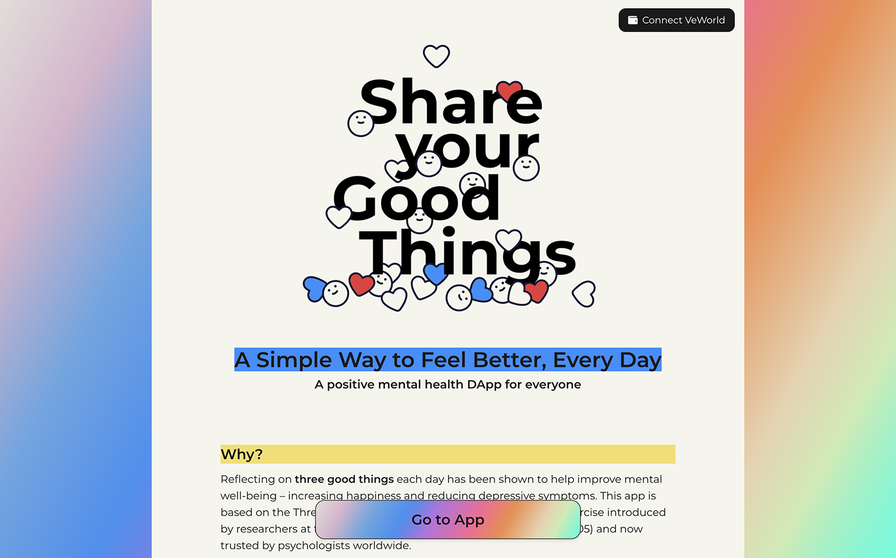
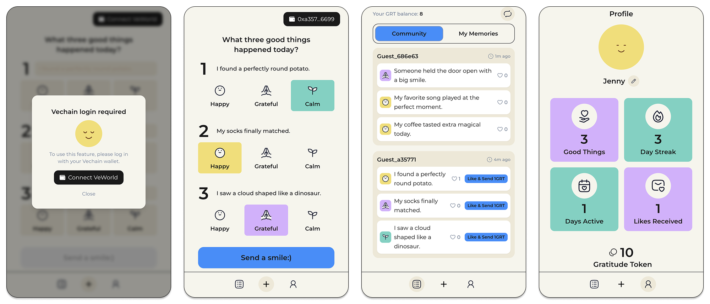

# Share Your Good Things DApp

[**Live Demo**](https://share-your-good-things.vercel.app/)

A modern, mobile-friendly decentralized application (DApp) for sharing daily positive moments, inspired by the "Three Good Things" method from positive psychology. Built with React, TypeScript, tailwindcss, and VeChain blockchain.

[](https://three-good-things.vercel.app)

## What is this project?

**Share Your Good Things** is a web DApp designed to help users improve their mental well-being by reflecting on and sharing three good things each day. Users can:

- Post their daily positive experiences
- Search and read uplifting stories from others
- Connect with a supportive community

The app is based on research showing that reflecting on positive events can reduce stress, anxiety, and depression. Blockchain features use VeChain and the GRT token, while other app features (profiles) are powered by Supabase.


[](https://three-good-things.vercel.app)

## How does it work?

1. **Sign in with your VeChain wallet** to get started. Your account is secure and private.
2. **Record your "Three Good Things" each day.** Earn GRT (Gratitude Token) for every post!
   - GRT is a custom, non-transferable token created for this app. It is implemented according to the VIP-180 (VeChain's ERC20-equivalent) standard. GRT is used to encourage engagement and send likes to others' posts, has no monetary value, and is not intended for trading or investment.
3. **Explore the community’s good things** and use your tokens to send likes and encouragement.
4. **View your personal record** of good things on your profile page and celebrate your progress!

## Tech Stack

- React + TypeScript + Vite
- Tailwind CSS for styling
- VeChain DAppKit for wallet integration
- VeChain blockchain for GRT token and post storage
- Supabase for user profiles
- **Icon set:** [Hugeicons](https://hugeicons.com/)

## How to run locally

> **Note:** This project is designed for the VeChain testnet (not mainnet). All blockchain interactions and demo endpoints assume a testnet environment. If you wish to deploy on mainnet, you will need to update the contract addresses and endpoints accordingly.

1. Clone this repository and install dependencies:

   ```sh
   npm install
   ```

2. Create a `.env` file with the following content (replace with your own endpoints if needed):

   ```env
   VITE_THOR_URL="https://testnet.vechain.org"
   VITE_SUPABASE_URL="https://fjwbrmcwobugcdlkvujy.supabase.co"
   VITE_SUPABASE_ANON_KEY="your-supabase-anon-key"
   ```

   > ⚠️ The provided endpoints are for the demo deployment. For full functionality, you may need your own Supabase project

3. Start the dev server:

   ```sh
   npm run dev
   ```

4. Open [http://localhost:5173](http://localhost:5173) in your browser.

## Author

Karin Kiho (June 2025)
